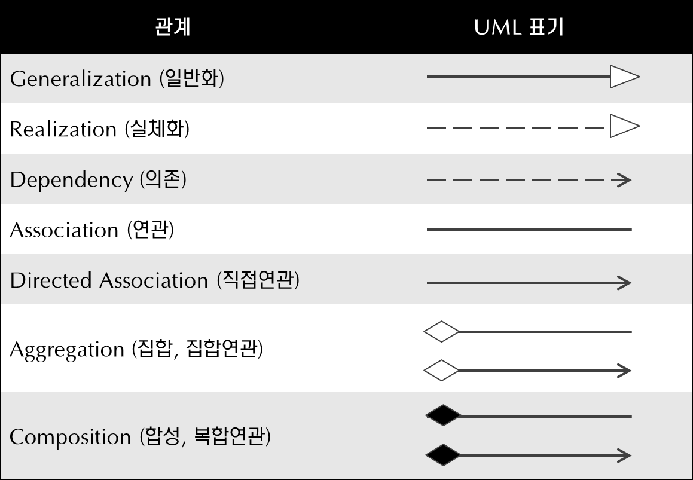

# 시스템 구성 정리

## 공통 처리 흐름

- main()에서 input.txt 파일을 한 줄씩 읽음
- 각 명령어 (1 1, 2 1, ...)를 파싱하여 해당 UI 클래스의 input() 호출
- UI는 Control 클래스를 호출하여 로직 처리
- Control 클래스는 필요시 Entity 클래스를 통해 데이터 처리
- UI는 결과를 output.txt에 출력

---

## 회원가입

**Classes**

- `AddAccountUI`
- `AddAccount`
- `Account`
- `newAcc: Account`

**Methods**

- `input()`: 바운더리
- `addNewAccount()`: 컨트롤
- `Account()`: 아이디,비번,전번저장 / 엔티티
- 기능: 사용자가 '1 1 아이디 비밀번호 전화번호' 입력하면 계정 생성
- 파일 입력: `1 1 아이디 비밀번호 전화번호`
- 파일 출력: `1.1. 회원가입`
  `> [ID] [비밀번호] [전화번호]`
- 검증 로직: 중복 아이디 검증 필요
- 저장: 새 계정을 Account에 추가

---

## 로그인

**Classes**

- `LoginUI`
- `Login`
- `Account`
- `Session`

**Methods**

- `input()`: 바운더리
- `loginRequest()`: 컨트롤
- `verifyAccount()`: 엔티티
- `saveCurrentUser()`: 현재유저아이디저장 / 엔티티

---

## 로그아웃

**Classes**

- `LogoutUI`
- `Logout`
- `Session`

**Methods**

- `input()`: 바운더리
- `logoutRequest()`: 컨트롤
- `clearSession()`: 엔티티

---

## 자전거 등록

**Classes**

- `AddBikeUI`
- `AddBike`
- `Bike`
- `newBike: Bike`

**Methods**

- `input()`: 바운더리
- `addNewBike()`: 컨트롤
- `Bike()`: 자전거아이디,자전거제품명저장 / 엔티티

---

## 자전거 대여

**Classes**

- `RentUI`
- `Rent`
- `Session`
- `RentList`

**Methods**

- `input()`: 바운더리
- `requestRent()`: 컨트롤
- `getCurrentUser()`: 엔티티
- `findBike()`: 엔티티
- `addRecord()`: 자전거객체저장 / 엔티티

---

## 자전거 대여 내역 조회

**Classes**

- `RentRecordUI`
- `RentRecord`
- `RentList`
- `Session`
- `Bike`

**Methods**

- `input()`: 바운더리
- `requestRentList()`: 컨트롤
- `getCurrentUser()`: 엔티티
- `getRentRecord()`: 엔티티
- `getBikeDetails()`: 엔티티

---

## 종료

**Classes**

- `CloseUI`
- `Close`
- `System`

**Methods**

- `input()`: 바운더리
- `closeRequest()`: 컨트롤
- `systemClose()`: 컨트롤

---

## Analysis Class Diagram 정리

> `newAcc: Account` 등은 단순 객체이므로 클래스 다이어그램에는 포함하지 않음.

### Boundary

- `AddAccountUI` : input();
- `LoginUI` : input();
- `LogoutUI` : input();
- `AddBikeUI` : input();
- `RentUI` : input();
- `RentRecordUI` : input();
- `CloseUI` : input();

### Control

- `AddAccount` : addNewAccount();
- `Login` : loginRequest();
- `Logout` : logoutRequest();
- `AddBike` : addNewBike();
- `Rent` : requestRent(); findBike();
- `RentRecord` : requestRentList();
- `Close` : closeRequest();
- `System` : systemClose();

### Entity

- `Account` : userID, password, phoneNumber / verifyAccount(); Account(); getRentList();
- `Bike` : bikeID, bikeName / Bike(); getBikeDetails();
- `RentList` : bikeRecords / addRecord(); getRentRecord();
- `Session` : currentUserID / saveCurrentUser(); clearSession(); getCurrentUser();

---

## Association

> _하나의 컨트롤 클래스가 복수의 엔티티 인스턴스를 다룰 수 있는가?_

### Multiplicity

- 회원가입: 중복 아이디 검증해야되므로 리스트 전체에 접근가능해야함! `1..*`
- 로그인: 아이디 비번 검증하려면 리스트 전체를 조회(접근)해야함! `1..*`
- 로그인/로그아웃 상태: 세션에 `1대1`로 업데이트됨
- 자전거 등록: 자전거가 아예 없는 상태에도, 자전거가 있을때도 아이디 중복여부 검증해서 새로 등록해야함. `0..*`
- 자전거 대여: 자전거 아이디를 자전거 리스트 전체에서 조회가능해야함! `1..*`
- 자전거 대여 목록 조회: rentList는 회원과 `1대1`로 생성

### Aggregation

- 전체 객체가 사라져도 부분 객체는 독립적으로 존재할 수 있는 경우
  - RentList가 사라져도 Bike는 독립적으로 존재

### Composition

- 전체 객체가 사라지면 부분 객체도 함께 소멸
  - Account가 사라지면 RentList도 소멸

## Designed Class Diagram로 변환하기

- 생성자 함수도 operation에 추가하기 (but, 리턴타입 없이 표현)
- 의존(참조해오는) 속성을 attribute에 추가하기
- 오퍼레이션(파라미터이름: 타입) 기재하기
- 속성: 반환타입 기재하기
